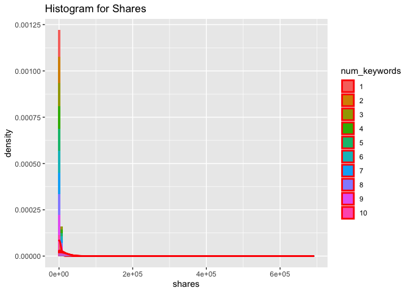

Project II ST558
================
Pratap Adhikari
10/9/2020

Read the data

``` r
popData<- read_csv("OnlineNewsPopularity.csv")
head(popData)
```

    ## # A tibble: 6 x 61
    ##   url   timedelta n_tokens_title n_tokens_content n_unique_tokens
    ##   <chr>     <dbl>          <dbl>            <dbl>           <dbl>
    ## 1 http~       731             12              219           0.664
    ## 2 http~       731              9              255           0.605
    ## 3 http~       731              9              211           0.575
    ## 4 http~       731              9              531           0.504
    ## 5 http~       731             13             1072           0.416
    ## 6 http~       731             10              370           0.560
    ## # ... with 56 more variables: n_non_stop_words <dbl>,
    ## #   n_non_stop_unique_tokens <dbl>, num_hrefs <dbl>, num_self_hrefs <dbl>,
    ## #   num_imgs <dbl>, num_videos <dbl>, average_token_length <dbl>,
    ## #   num_keywords <dbl>, data_channel_is_lifestyle <dbl>,
    ## #   data_channel_is_entertainment <dbl>, data_channel_is_bus <dbl>,
    ## #   data_channel_is_socmed <dbl>, data_channel_is_tech <dbl>,
    ## #   data_channel_is_world <dbl>, kw_min_min <dbl>, kw_max_min <dbl>,
    ## #   kw_avg_min <dbl>, kw_min_max <dbl>, kw_max_max <dbl>, kw_avg_max <dbl>,
    ## #   kw_min_avg <dbl>, kw_max_avg <dbl>, kw_avg_avg <dbl>,
    ## #   self_reference_min_shares <dbl>, self_reference_max_shares <dbl>,
    ## #   self_reference_avg_sharess <dbl>, weekday_is_monday <dbl>,
    ## #   weekday_is_tuesday <dbl>, weekday_is_wednesday <dbl>,
    ## #   weekday_is_thursday <dbl>, weekday_is_friday <dbl>,
    ## #   weekday_is_saturday <dbl>, weekday_is_sunday <dbl>, is_weekend <dbl>,
    ## #   LDA_00 <dbl>, LDA_01 <dbl>, LDA_02 <dbl>, LDA_03 <dbl>, LDA_04 <dbl>,
    ## #   global_subjectivity <dbl>, global_sentiment_polarity <dbl>,
    ## #   global_rate_positive_words <dbl>, global_rate_negative_words <dbl>,
    ## #   rate_positive_words <dbl>, rate_negative_words <dbl>,
    ## #   avg_positive_polarity <dbl>, min_positive_polarity <dbl>,
    ## #   max_positive_polarity <dbl>, avg_negative_polarity <dbl>,
    ## #   min_negative_polarity <dbl>, max_negative_polarity <dbl>,
    ## #   title_subjectivity <dbl>, title_sentiment_polarity <dbl>,
    ## #   abs_title_subjectivity <dbl>, abs_title_sentiment_polarity <dbl>,
    ## #   shares <dbl>

``` r
#day<- function(day, ...){}
```

### Processing

``` r
# checking if any missing values in the raw data
anyNA(popData)
```

    ## [1] FALSE

``` r
#summary(popData)
```

FALSE indicates there are no missing values. Next, to split the train
and test set

``` r
# Create train and test data set.
set.seed(2)
train<- sample(1:nrow(popData), size = nrow(popData) *0.7)
test<- dplyr::setdiff(1:nrow(popData), train)

popDataTrain<- popData[train, -1]
popDataTest<- popData[test,-1]
```

``` r
#difine all of  the days variables on data set
weekday<- c("weekday_is_monday", "weekday_is_tuesday", "weekday_is_wednesday", "weekday_is_thursday", "weekday_is_friday", "weekday_is_saturday", "weekday_is_sunday", "is_weekend" )
#create final train data set
popDataFinalTrain<- popDataTrain  %>% mutate(weekday= popDataTrain$weekday_is_monday) %>% select( -all_of(weekday), -is_weekend )

#create final test data set
popDataFinalTest<- popDataTest  %>% mutate(weekday= popDataTest$weekday_is_monday) %>% select( -all_of(weekday), -is_weekend )
```

# Tree Based model

``` r
popTreeFit<- tree(shares~ ., data=popDataFinalTrain,
                  control= tree.control(nrow(popDataFinalTrain), mincut = 10, minsize = 20, mindev = 0.01))

plot(popTreeFit); text(popTreeFit)
```

<!-- -->

``` r
summary(popTreeFit)
```

    ## 
    ## Regression tree:
    ## tree(formula = shares ~ ., data = popDataFinalTrain, control = tree.control(nrow(popDataFinalTrain), 
    ##     mincut = 10, minsize = 20, mindev = 0.01))
    ## Variables actually used in tree construction:
    ## [1] "kw_avg_avg"                "self_reference_min_shares"
    ## Number of terminal nodes:  3 
    ## Residual mean deviance:  1.19e+08 = 3.303e+12 / 27750 
    ## Distribution of residuals:
    ##     Min.  1st Qu.   Median     Mean  3rd Qu.     Max. 
    ## -67800.0  -2103.0  -1627.0      0.0   -426.8 683800.0

``` r
#Using selected predictors only
#popDataFinalTrain$weekday<- as.factor(popDataFinalTrain$weekday)
popTreeFit1<- tree(shares~ kw_avg_avg + self_reference_min_shares + weekday ,
                  data=popDataFinalTrain)
plot(popTreeFit1); text(popTreeFit)
summary(popTreeFit1)
```

``` r
#CV error
cvTree<- cv.tree(popTreeFit)
cvTree
```

    ## $size
    ## [1] 3 2 1
    ## 
    ## $dev
    ## [1] 3.390069e+12 3.398327e+12 3.398327e+12
    ## 
    ## $k
    ## [1]        -Inf 42031209238 48385621441
    ## 
    ## $method
    ## [1] "deviance"
    ## 
    ## attr(,"class")
    ## [1] "prune"         "tree.sequence"

Plot of CV error change

``` r
plot(cvTree$size, cvTree$dev, type="b")
```

<!-- -->

### Prediction

``` r
predpop<- predict(popTreeFit, newdata= dplyr::select(popDataFinalTest, -shares) )

#RMSE
treeRMSE<- sqrt(mean(predpop - popDataFinalTest$shares)^2)
```

# 

# Boosted Tree method:

``` r
boostFit<- gbm(shares~ ., data=popDataFinalTrain, distribution = "gaussian", n.trees = 5000, shrinkage = 0.1, interaction.depth = 4)

boostPred<- predict(boostFit, newdata= dplyr::select(popDataFinalTest, -shares), n.trees=5000)
```

compare RMSE values (root of test prediction error)

``` r
boostRMSE<- sqrt(mean(boostPred - popDataFinalTest$shares)^2 )

#table the RMSE from both of the model fits
RMSE<- c(boost=boostRMSE, tree= treeRMSE)

kable(as.data.frame( RMSE), caption = "RMSE table")
```

|       |     RMSE |
| :---- | -------: |
| boost | 323.2867 |
| tree  | 160.4879 |

RMSE table

# 

# Using rpart function

``` r
rpartFit<- rpart(shares~., data=popDataFinalTrain, 
      control= rpart.control( cp=0.01, minsplit = 6, 
              maxcompete = 4, maxsurrogate = 5, usesurrogate = 2, xval = 10,
              surrogatestyle = 0, maxdepth = 30 ) )


plot(rpartFit); text(rpartFit, pretty = 1, cex=0.8)
#summary(rpartFit)
```

``` r
rpartFit<- rpart(shares~., data=popDataFinalTrain, 
      control= rpart.control( cp=0.01, minsplit = 6, minbucket = round(minsplit/3),
              maxcompete = 4, maxsurrogate = 5, usesurrogate = 2, xval = 10,
              surrogatestyle = 0, maxdepth = 30 ) )


plot(rpartFit); text(rpartFit, pretty = 1, cex=0.8)
#summary(rpartFit)
```

``` r
library(knitr)
library(dplyr)
render("Project II.Rmd", output_format= "github_document", output_file= I("README.md") )
```

``` r
rpart(shares~., data=popDataFinalTrain, 
      control= rpart.control(minsplit = 3, minbucket = round(minsplit/3), cp=0.01, 
              maxcompete = 4, maxsurrogate = 5, usesurrogate = 2, xval = 10,
              surrogatestyle = 0, maxdepth = 30 ) )
```

#
