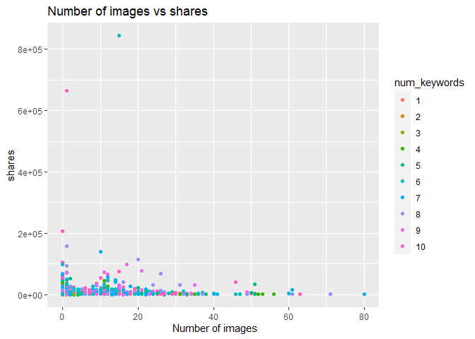
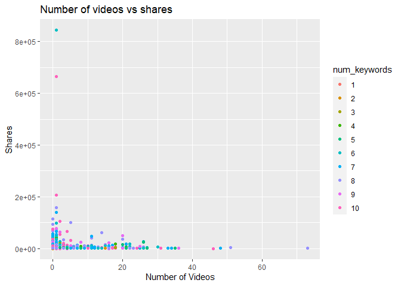
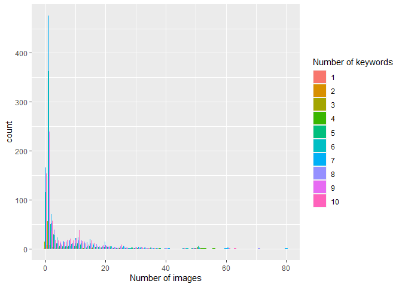
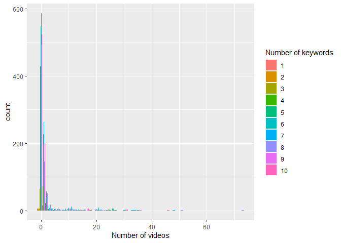
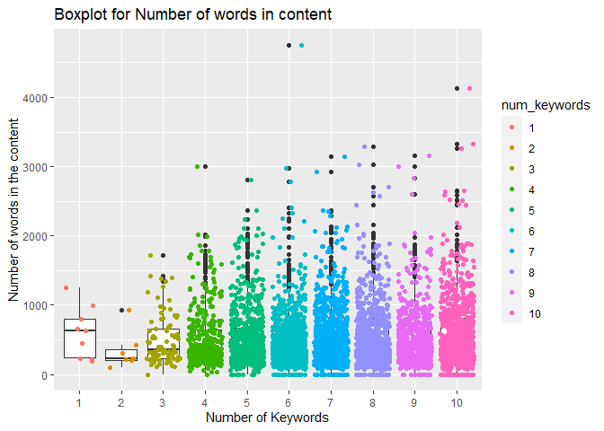
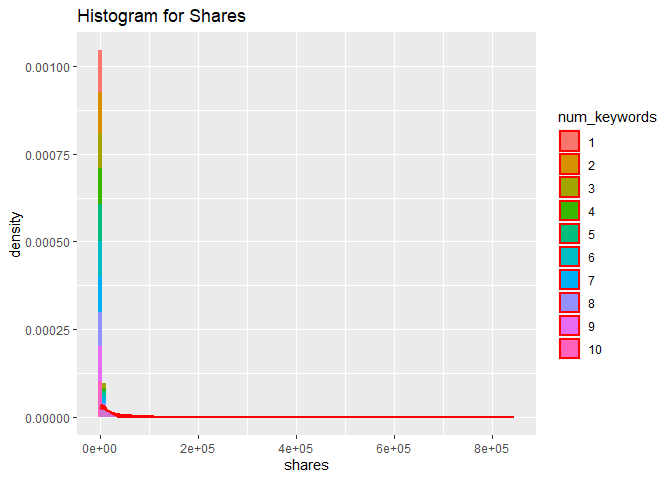
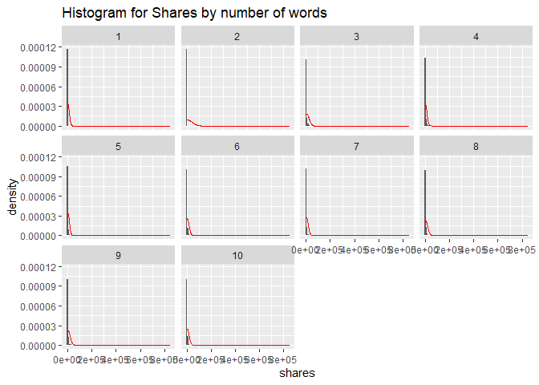
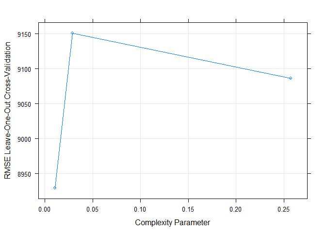
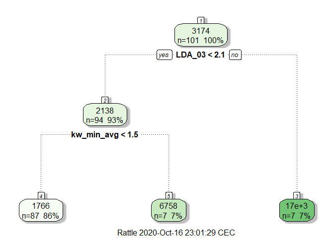

Project II ST558
================
Pratap Adhikari
10/9/2020

# Introduction

The project I am going to do is about the analysis of the Online News
Popularity. .The articles were said to be published by
[Mashable](www.mashable.com) . The data set were downloaded from this
[link](https://archive.ics.uci.edu/ml/datasets/Online+News+Popularity) .
The response variable is `shares` I will be analyzing the popularity by
fitting the two different tree based models: + a (non ensemble) tree
based model chosen using leave one out cross validation + (LOOCV) and a
boosted tree model chosen using cross-validation.

## Required packages

The list of packages are: tidyverse, knitr, caret, gbm, rattle gbm,
rmarkdown, ggplot2.

## Attribute Information:

Number of Attributes: 61 (58 predictive attributes, 2 non-predictive, 1
goal field)

### Attribute Information:

0.  url: URL of the article (non-predictive)
1.  timedelta: Days between the article publication and the dataset
    acquisition (non-predictive)
2.  n\_tokens\_title: Number of words in the title
3.  n\_tokens\_content: Number of words in the content
4.  n\_unique\_tokens: Rate of unique words in the content
5.  n\_non\_stop\_words: Rate of non-stop words in the content
6.  n\_non\_stop\_unique\_tokens: Rate of unique non-stop words in the
    content
7.  num\_hrefs: Number of links
8.  num\_self\_hrefs: Number of links to other articles published by
    Mashable
9.  num\_imgs: Number of images
10. num\_videos: Number of videos
11. average\_token\_length: Average length of the words in the content
12. num\_keywords: Number of keywords in the metadata
13. data\_channel\_is\_lifestyle: Is data channel ‘Lifestyle’?
14. data\_channel\_is\_entertainment: Is data channel ‘Entertainment’?
15. data\_channel\_is\_bus: Is data channel ‘Business’?
16. data\_channel\_is\_socmed: Is data channel ‘Social Media’?
17. data\_channel\_is\_tech: Is data channel ‘Tech’?
18. data\_channel\_is\_world: Is data channel ‘World’?
19. kw\_min\_min: Worst keyword (min. shares)
20. kw\_max\_min: Worst keyword (max. shares)
21. kw\_avg\_min: Worst keyword (avg. shares)
22. kw\_min\_max: Best keyword (min. shares)
23. kw\_max\_max: Best keyword (max. shares)
24. kw\_avg\_max: Best keyword (avg. shares)
25. kw\_min\_avg: Avg. keyword (min. shares)
26. kw\_max\_avg: Avg. keyword (max. shares)
27. kw\_avg\_avg: Avg. keyword (avg. shares)
28. self\_reference\_min\_shares: Min. shares of referenced articles in
    Mashable
29. self\_reference\_max\_shares: Max. shares of referenced articles in
    Mashable
30. self\_reference\_avg\_sharess: Avg. shares of referenced articles in
    Mashable
31. weekday\_is\_monday: Was the article published on a Monday?
32. weekday\_is\_tuesday: Was the article published on a Tuesday?
33. weekday\_is\_wednesday: Was the article published on a Wednesday?
34. weekday\_is\_thursday: Was the article published on a Thursday?
35. weekday\_is\_friday: Was the article published on a Friday?
36. weekday\_is\_saturday: Was the article published on a Saturday?
37. weekday\_is\_sunday: Was the article published on a Sunday?
38. is\_weekend: Was the article published on the weekend?
39. LDA\_00: Closeness to LDA topic 0
40. LDA\_01: Closeness to LDA topic 1
41. LDA\_02: Closeness to LDA topic 2
42. LDA\_03: Closeness to LDA topic 3
43. LDA\_04: Closeness to LDA topic 4
44. global\_subjectivity: Text subjectivity
45. global\_sentiment\_polarity: Text sentiment polarity
46. global\_rate\_positive\_words: Rate of positive words in the content
47. global\_rate\_negative\_words: Rate of negative words in the content
48. rate\_positive\_words: Rate of positive words among non-neutral
    tokens
49. rate\_negative\_words: Rate of negative words among non-neutral
    tokens
50. avg\_positive\_polarity: Avg. polarity of positive words
51. min\_positive\_polarity: Min. polarity of positive words
52. max\_positive\_polarity: Max. polarity of positive words
53. avg\_negative\_polarity: Avg. polarity of negative words
54. min\_negative\_polarity: Min. polarity of negative words
55. max\_negative\_polarity: Max. polarity of negative words
56. title\_subjectivity: Title subjectivity
57. title\_sentiment\_polarity: Title polarity
58. abs\_title\_subjectivity: Absolute subjectivity level
59. abs\_title\_sentiment\_polarity: Absolute polarity level
60. shares: Number of shares (target)

# Read in Data set

``` r
#Read the data
popData<- read_csv("OnlineNewsPopularity.csv")
```

## Processing

``` r
# checking if any missing values in the raw data
anyNA(popData)
```

    ## [1] FALSE

FALSE indicates there are no missing values. Next, to split the train
and test set

# For the weekday: wednesday

``` r
#data table

popData$num_keywords<- as.factor(popData$num_keywords)

popData<- popData %>% select(-is_weekend, -1)

#define weekdays
weekDays<- c("monday", "tuesday", "wednesday", "thursday", "friday", "saturday", "sunday")


if(params$weekday== weekDays[1]) { 
  Analysis=  popData$weekday_is_monday
  } else if (params$weekday== weekDays[2]){
    Analysis= popData$weekday_is_tuesday
  } else if (params$weekday== weekDays[3]){
    Analysis= popData$weekday_is_wednesday
  } else if (params$weekday== weekDays[4]){
    Analysis= popData$weekday_is_thursday
  } else if (params$weekday== weekDays[5]){
    Analysis= popData$weekday_is_friday
  } else if (params$weekday== weekDays[6]){
    Analysis= popData$weekday_is_saturday
  } else if (params$weekday== weekDays[7]){
    Analysis= popData$weekday_is_sunday
  } else {
    Analysis="error"
  }

finalData<- popData %>% mutate(Analysis) 
popDayData<- popData  %>% filter(Analysis == params$value) 
popDayData
```

``` r
# Create train and test data set.
set.seed(2001)
train<- sample(1:nrow(popDayData), size = nrow(popDayData) *0.7)
test<- dplyr::setdiff(1:nrow(popDayData), train)

popDataFinalTrain<- popDayData[train, -1]
popDataFinalTest<- popDayData[test,-1]
```

# Analysis

## Summary about the train data

``` r
sumryData<- popDataFinalTrain %>% select(num_imgs, num_videos, n_tokens_content, global_subjectivity,  global_rate_positive_words, paste0("weekday_is_", params$weekday) , num_keywords, shares)


# summary statistics of `shares` variable
summary(sumryData$shares)
```

    ##    Min. 1st Qu.  Median    Mean 3rd Qu.    Max. 
    ##      23     885    1300    3354    2500  843300

``` r
#Number of key words

  kable(table(sumryData$num_keywords))
```

| Var1 | Freq |
| :--- | ---: |
| 1    |    9 |
| 2    |    7 |
| 3    |   85 |
| 4    |  364 |
| 5    |  671 |
| 6    |  880 |
| 7    |  991 |
| 8    |  795 |
| 9    |  564 |
| 10   |  838 |

## Plots

### scatter plots

``` r
#scatter plot
#number of images vs shares
ggplot(sumryData, aes(x=num_imgs, y=shares, by=num_keywords)) + geom_point(aes(color=num_keywords)) + ggtitle("Number of images vs shares") + labs(x=" Number of images")
```

<!-- -->

``` r
# +  geom_smooth(method='lm', color='green')

#number of videos vs shares
ggplot(sumryData, aes(x=num_videos, y=shares, by=num_keywords)) + geom_point(aes(color=num_keywords))  + labs(x="Number of Videos", y="Shares", title= "Number of videos vs shares" )+  scale_fill_discrete(name="Number of keywords")
```

<!-- -->

### Bar plot

``` r
ggplot(sumryData, aes(x=num_imgs)) + geom_bar(aes(fill=num_keywords), position = "dodge") + xlab("Number of images") + scale_fill_discrete(name="Number of keywords")
```

<!-- -->

``` r
ggplot(sumryData, aes(x=num_videos)) + geom_bar(aes(fill=num_keywords), position = "dodge") + xlab("Number of videos") + scale_fill_discrete(name="Number of keywords")
```

<!-- -->

### Box plot

``` r
ggplot(sumryData, aes(x=num_keywords, y=n_tokens_content)) + geom_boxplot() + geom_jitter(aes(color=num_keywords)) + ggtitle("Boxplot for Number of words in content") + xlab("Number of Keywords") + ylab("Number of words in the content")
```

<!-- -->

### Histogram

``` r
ggplot(sumryData, aes(shares, ..density.., fill=num_keywords)) + geom_histogram(bins = 100) + geom_density(col="red", lwd=1, adjust=50, alpha=0.5) + ggtitle("Histogram for Shares")
```

<!-- -->

``` r
ggplot(sumryData, aes(shares, ..density..)) + geom_histogram(bins = 100) + geom_density(col="red", lwd=0.5, adjust=50) +facet_wrap(~num_keywords, ) + ggtitle("Histogram for Shares by number of words")
```

<!-- -->

## Use of `Train` function and method=`rpart`

``` r
popFit<- train(shares~ ., data=popDataFinalTrain[600:700, ],
             method="rpart",
             preProcess= c("center", "scale"),
             trControl= trainControl(method = "LOOCV"))
```

``` r
plot(popFit)
```

<!-- -->

``` r
#plot(popFit$finalModel); text(popFit$finalModel, pretty = 1, cex=0.8)
fancyRpartPlot(popFit$finalModel)
```

<!-- -->

### Prediction

``` r
predpop<- predict(popFit, newdata= dplyr::select(popDataFinalTest, -shares) )

#RMSE
treeRMSE<- sqrt(mean(predpop - popDataFinalTest$shares)^2)
```

# 

## Boosted Tree method:

``` r
#fit the model
boostFit<- gbm(shares~ ., data=popDataFinalTrain[1:50,], 
              distribution = "gaussian", 
              n.trees = 10, 
              shrinkage = 0.1, 
              interaction.depth = 4)

#prediction
boostPred<- predict(boostFit, newdata= dplyr::select(popDataFinalTest, -shares), 
                    n.trees=10)

#RMSE value
boostRMSE<- sqrt(mean(boostPred - popDataFinalTest$shares)^2 )
```

### compare RMSE values (root of test prediction error)

``` r
#table the RMSE from both of the model fits
RMSE<- c(boost=boostRMSE, tree_based= treeRMSE)

kable(as.data.frame( RMSE), caption = "RMSE table")
```

|             |     RMSE |
| :---------- | -------: |
| boost       | 808.6099 |
| tree\_based | 793.5485 |

RMSE table

From the above table the model having lowest value of RMSE is chosen to
be appropriate to fit the data set.
